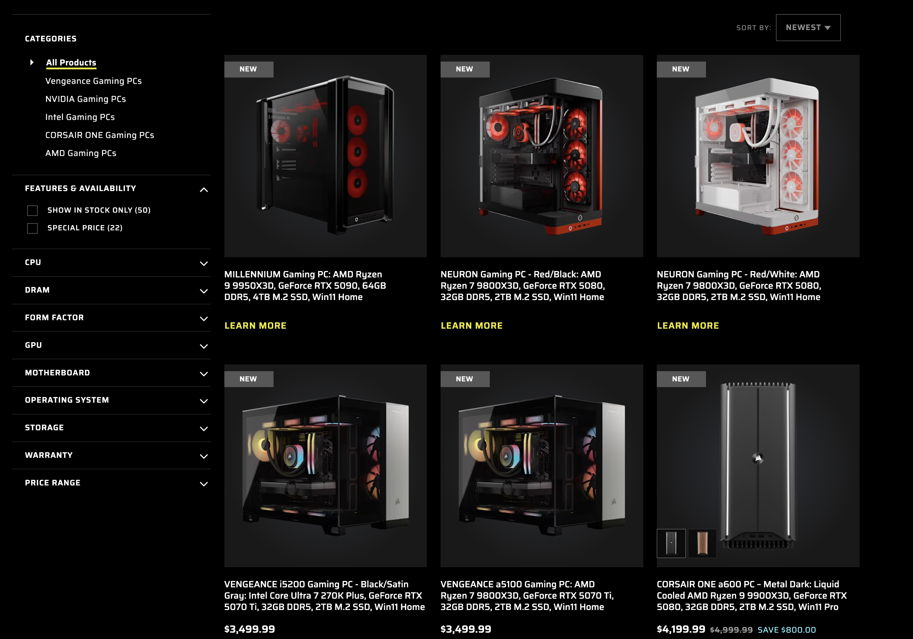
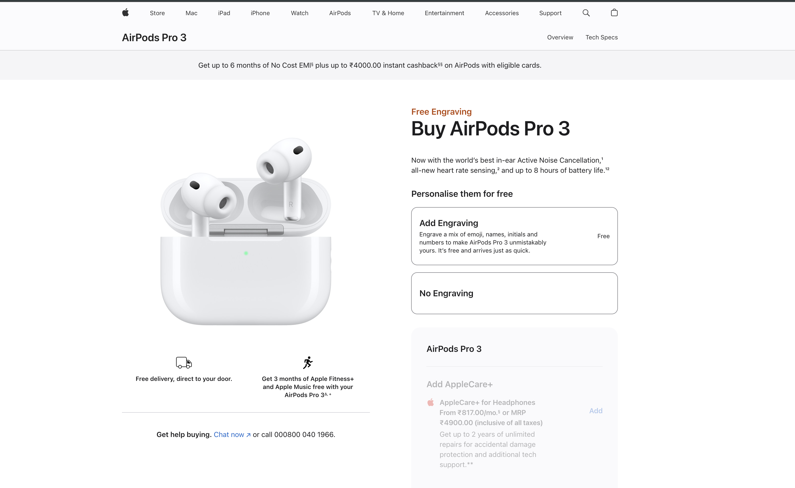
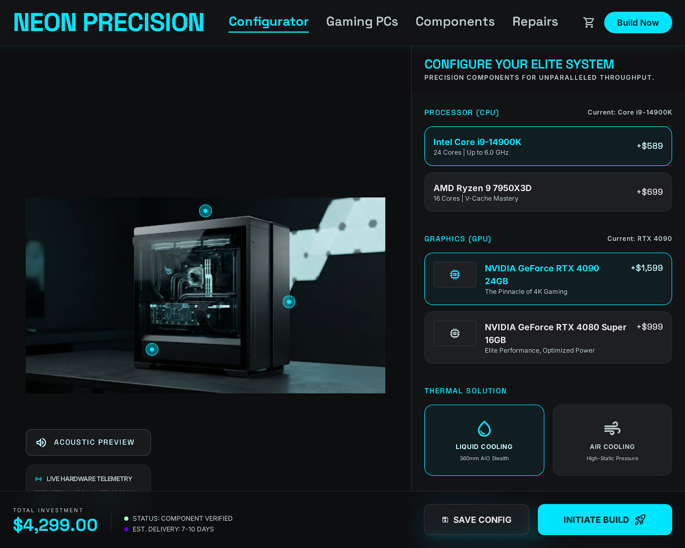
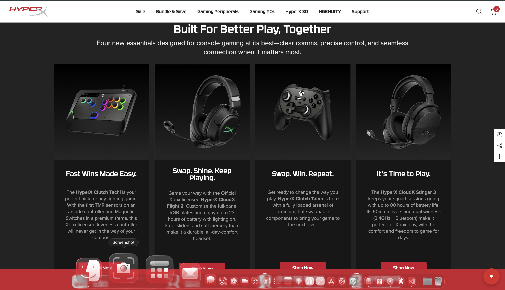
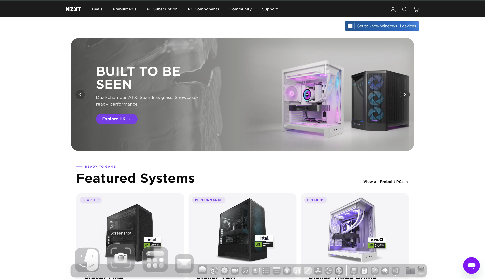
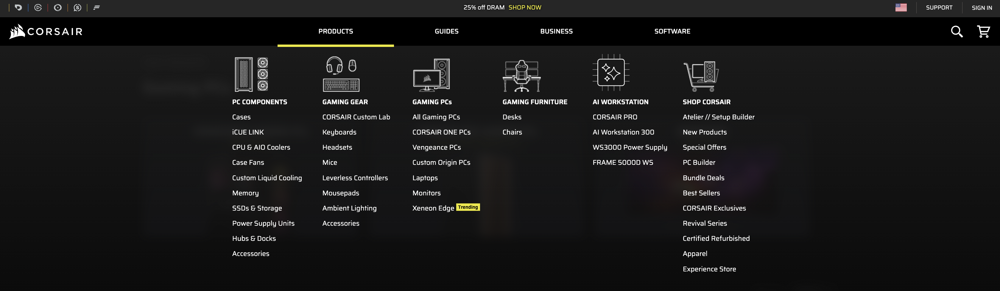

https://www.corsair.com/us/en/c/gaming-computers - use the components designs from this - 

inside cards should look like this -  ,  

On the home page when scrolled add  - make it in during scroll , 

 - keep the theme and edges like this and futristic 

 - when open add a free scrollable section like this too make more tempting but fill it with components like rgb keyboard , rgb mouse , rgb cpu , etc 

 - navbar component like this with images too

git repo to push - https://github.com/Prabuddha747/NextgenComputerPage

